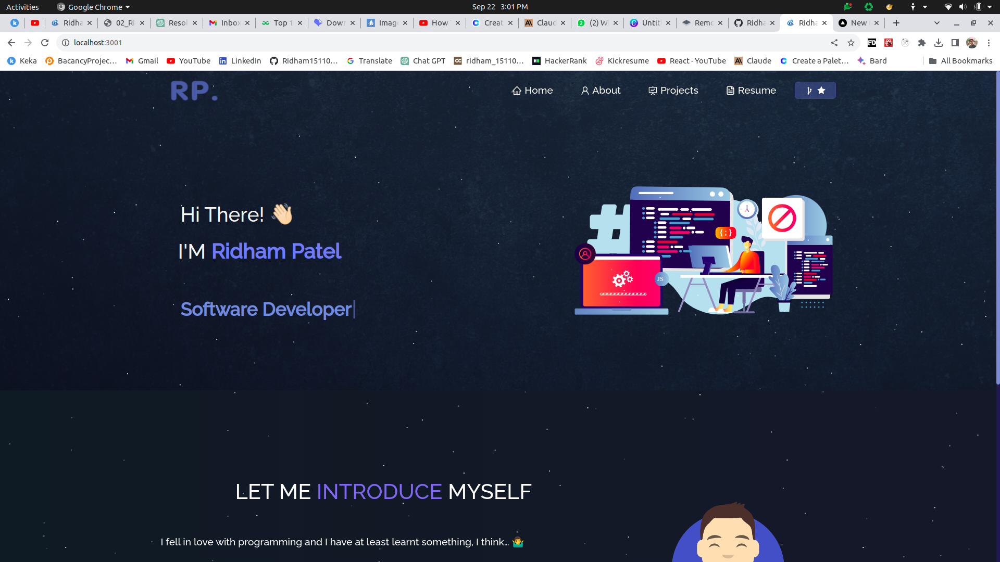
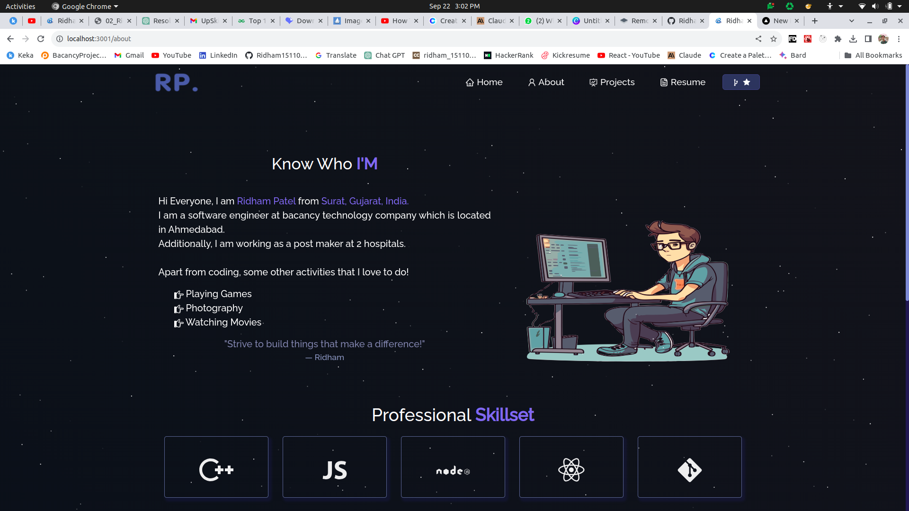

# Portfolio Website

## Overview

This is my personal portfolio website built using React. It showcases my projects, skills, and provides information about me.

You can visit the website here: [Link to Portfolio Website](https://your-website-url.com)

This project was built using these technologies.

- React.js
- Node.js
- Express.js
- CSS3
- VsCode
- Vercel

## Features

**📖 Multi-Page Layout**

**🎨 Styled with React-Bootstrap and Css with easy to customize colors**

**📱 Fully Responsive**

## Getting Started

Clone down this repository. You will need `node.js` and `git` installed globally on your machine.

## 🛠 Installation and Setup Instructions

1. Installation: `npm install`

2. In the project directory, you can run: `npm start`

Runs the app in the development mode.\
Open [http://localhost:3000](http://localhost:3000) to view it in the browser.
The page will reload if you make edits.

## Usage Instructions

Open the project folder and Navigate to `/src/components/`.  
You will find all the components used and you can edit your information accordingly.

### Show your support

Give a ⭐ if you like this website!

## License

This project is licensed under the MIT License.

## Contact

### Ridham Patel
Email: ridhamvavaliya12345@gmail.com
LinkedIn: https://www.linkedin.com/in/ridham-patel-0960921b8/

